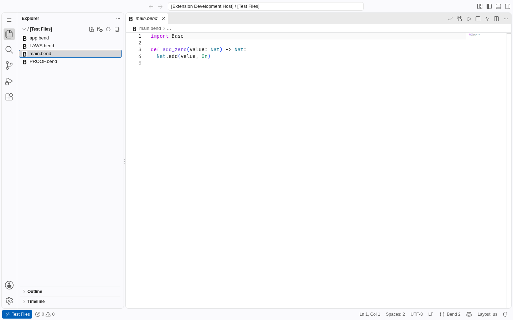

# Bend 2 for VS Code

<p align="center">
  <strong>Write, inspect, and verify Bend 2 programs without leaving VS Code.</strong>
</p>

<p align="center">
  <a href="https://github.com/nuxyel/bend2-vscode/actions/workflows/ci.yml"></a>
  <a href="https://github.com/nuxyel/bend2-vscode/releases/latest"></a>
  <a href="https://github.com/nuxyel/bend2-vscode/blob/main/LICENSE"></a>
  <a href="https://code.visualstudio.com/"></a>
  <a href="https://github.com/HigherOrderCO/Bend/releases"></a>
</p>

Language support and development tools for [Bend 2](https://github.com/HigherOrderCO/Bend). The extension brings everyday editing, compiler-backed workflows, and proof-aware navigation together in one place.

## See it in action



*The editor screenshot uses the repository's own Bend dogfood project.*

## What you get

| Write | Understand | Verify and run |
| --- | --- | --- |
| Syntax highlighting, snippets, formatting, and completion | Hover, signature help, symbols, and cross-file navigation | Compiler diagnostics, check, build, and run commands |
| Bend-aware editor commands and workspace support | Proof Explorer for laws and proof files | JavaScript, native CPU, and GPU profiles when supported by Bend |

The extension also supports VS Code Web for process-free editing features. Compiler commands require a desktop or remote extension host with Bend installed.

## Install

Download the latest [VSIX release](https://github.com/nuxyel/bend2-vscode/releases/latest), then in VS Code run **Extensions: Install from VSIX...** and select the downloaded file. The compiler-backed commands require [Bend 2](https://github.com/HigherOrderCO/Bend) `2.0.28` or newer in the VS Code workspace environment.

See the [support policy](docs/SUPPORT.md) for supported compiler versions, hosts, and remote setups.

## Bend 2 in this repository

We dogfood the extension on a small, real Bend project in [`tests/dogfood/proof-project`](tests/dogfood/proof-project). It includes a model, `LAWS.bend`, and `PROOF.bend`; CI checks that Bend accepts the proof and opens the project in VS Code integration runs. The pinned compiler matrix covers the minimum supported release and a newer stable release. See the [dogfood guide](tests/dogfood/README.md).

Unit tests also use focused Bend snippets and captured compiler output as fixtures. The proof project is the place where this repository exercises the compiler itself.

## Development

Requirements: Node.js 22 or newer, VS Code 1.90 or newer for extension development, and Bend 2 for compiler-backed commands.

```bash
npm install
npm run check
npm run test:dogfood
npm run package
```

The dogfood command uses a compiler version from `tests/dogfood/compiler-versions.json`. On Linux or WSL, install a pinned version with `node scripts/install-dogfood-compiler.mjs <version>`; the installer checks the official release checksum. The regular cross-platform `npm run check` does not require Bend.

For host smoke tests, run `npm run test:integration` and `npm run test:web`. Set `VSCODE_VERSION=insiders` to target VS Code Insiders. Press `F5` with this repository open in VS Code to launch the Extension Development Host.

See [contributing](CONTRIBUTING.md), [release instructions](docs/RELEASING.md), and the [public roadmap](docs/ROADMAP.md). Release changes are listed in the [changelog](apps/vscode/CHANGELOG.md).

## Design principles

- **The compiler is the source of truth.** The extension must not silently invent a different Bend language.
- **Laws belong to humans.** The extension can navigate, explain, and verify `LAWS.bend`, but never rewrites laws automatically.
- **Every expensive operation is cancellable.** Typing stays responsive while the checker runs in the background.
- **Version mismatches are visible.** The active Bend executable and supported compiler version are shown in the UI.
- **No mandatory telemetry.** Diagnostics and source code stay local unless the user explicitly chooses otherwise.

## Contributing

Contributions are welcome. Read [`CONTRIBUTING.md`](CONTRIBUTING.md) before opening an issue or pull request. Use the issue forms for bugs and feature ideas.

## License

Apache-2.0. See [`LICENSE`](LICENSE).
